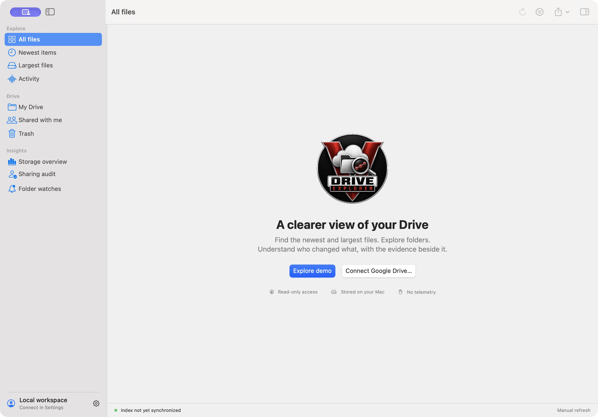
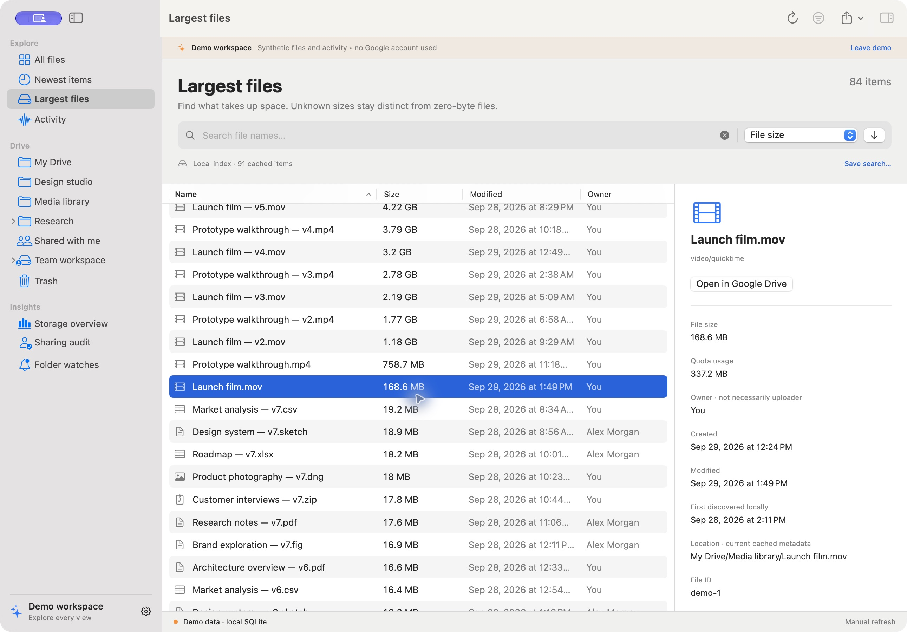
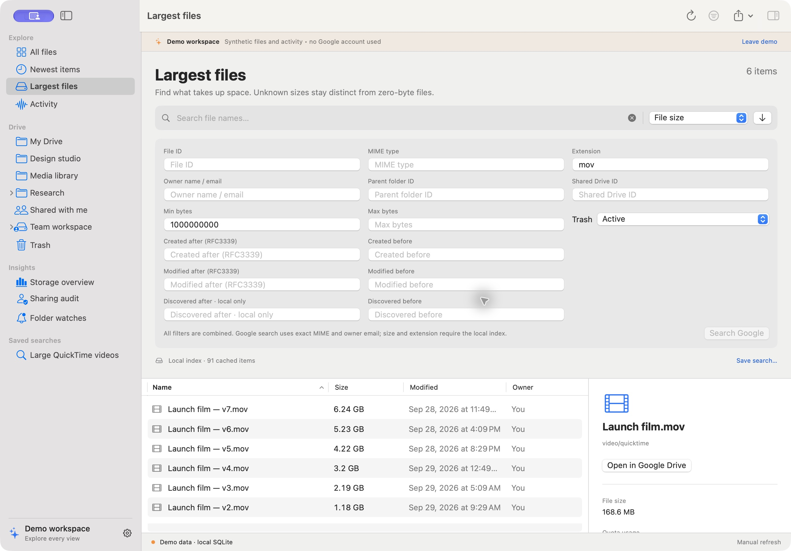
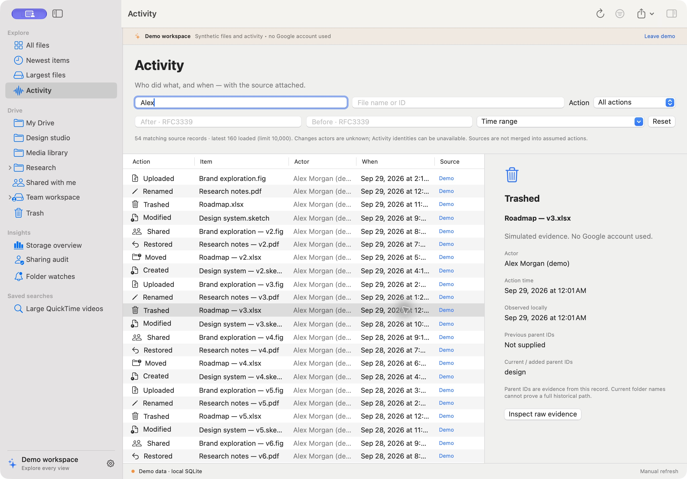
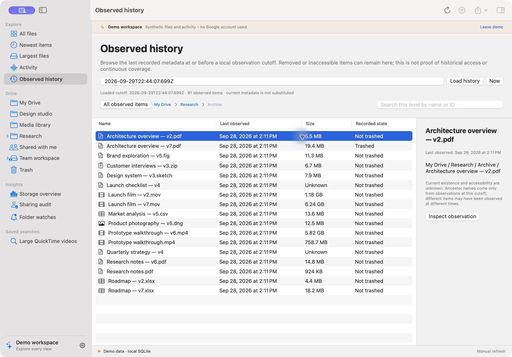
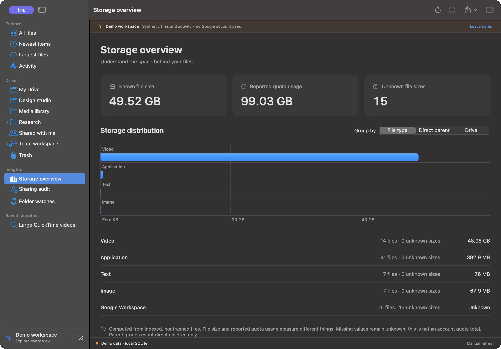

# Drive Explorer for macOS

### Native Google Drive exploration, advanced search, storage insights, and activity evidence

<p align="center">
  
</p>

<p align="center">
  Find what is new, what is large, where it lives, and what the available evidence says about who changed it.
</p>


[](LICENSE)

> [!IMPORTANT]
> **Work in progress — not done yet.** This repository contains a runnable native preview, not a production release. Local storage, search, exports, and synthetic API scenarios have automated coverage; native screens have been exercised with demo data. **Real-account validation is partial; token refresh, revocation, account switching and notification delivery remain unverified.** See [current status](#current-status) and [planned work — not done yet](#planned-work--not-done-yet).

---

## Contents

- [Overview](#overview)
- [Current status](#current-status)
- [Native app screenshots](#native-app-screenshots)
- [What it does](#what-it-does)
- [Build and run](#build-and-run)
- [Connect your Google account](#connect-your-google-account)
- [Using the explorer](#using-the-explorer)
- [Understanding the evidence](#understanding-the-evidence)
- [Data and architecture](#data-and-architecture)
- [Privacy and local data](#privacy-and-local-data)
- [Planned work — not done yet](#planned-work--not-done-yet)
- [Testing and verification](#testing-and-verification)
- [Troubleshooting](#troubleshooting)
- [Repository structure](#repository-structure)
- [Contributing](#contributing)
- [License](#license)

---

## Overview

Drive Explorer is a native SwiftUI desktop application for browsing and investigating Google Drive metadata. It combines the **Google Drive API** for files, folders, permissions, and change tracking with the **Google Drive Activity API** for the actor/action evidence Google makes available.

Use it to find recent additions, inspect the largest known files, combine metadata filters, review sharing details, or follow a folder's changes. A local SQLite index makes repeated searches and recorded-history review possible without requesting every file again. Real synchronization contacts Google; demo mode uses a separate synthetic workspace.

The app runs directly on macOS with system frameworks. It has no Python service, embedded browser UI, hosted backend, analytics SDK, or third-party runtime packages. Authentication opens your default browser. Metadata and activity remain the default connection. An optional management connection enables on-demand native previews and confirmed Move to Trash. There is no permanent-delete or empty-trash action.

## Current status

| Area | Status | What that means |
| --- | --- | --- |
| Native application | **Implemented / local preview** | SwiftUI windows, tables, sidebar, inspector, settings, charts, and keyboard commands. |
| Local indexing and search | **Implemented / tested** | Real SQLite integration and synthetic file/filter tests, including a 10,000-file integration scenario and separate 100,000-file core benchmark. |
| Google API integration | **Implemented / live validation partial** | Pagination, retries, changes and Activity have synthetic service-response tests. Live account validation is recorded with its limits in the verification report. |
| Desktop OAuth | **Implemented / live validation partial** | PKCE/state, loopback and token-envelope validation are tested. The app accepts the user’s saved sign-in; refresh, revocation, reconnect and account switching remain unverified. |
| File viewing and Trash | **Implemented / live validation pending** | Optional broader consent; bounded Quick Look previews, per-item capability checks and confirmation before Move to Trash. |
| Folder notifications | **Implemented / delivery not verified** | Rules, cooldown, permission status and a local test action are present; actual macOS delivery needs testing. |
| Historical evidence | **Implemented / locally tested** | Browse folders and inspect last-observed metadata at a chosen cutoff. Missing ancestors and uncertain historical access remain explicit. |
| Distribution | **Not done yet** | Local ad-hoc signed build only; no Developer ID signing, notarization, or downloadable production release. |

Detailed evidence and limits are in [Verification](docs/VERIFICATION.md) and the [native migration matrix](docs/PARITY.md). “Implemented” does not mean every real-account scenario has passed.

## Native app screenshots

These are direct captures from the native macOS app using synthetic files and `example.test` identities. They contain no connected Google account or private Drive inventory.

### Welcome and account setup



Start with the isolated demo or configure your own Desktop OAuth client.

### Largest files and metadata inspector



Compare known file size and quota usage while keeping owner, creation time, modification time, and local discovery separate.

### Advanced search



Combine filters and save useful searches. Local metadata filtering supports fields that Google does not offer as server-side query operators.

### Activity evidence



Review source-labelled records and inspect raw evidence. Unknown actors and incomplete coverage remain visible.

### Observed hierarchy at a cutoff



Browse retained snapshots with their observation times, original metadata, and explicit uncertainty about existence and access.

### Storage overview



Group known storage by type, direct parent, or Drive. Missing sizes stay **Unknown**; Workspace documents are not silently counted as zero-byte files. A [light appearance capture](docs/screenshots/storage.png) is also available.

## What it does

| Workspace | Current capabilities |
| --- | --- |
| Explorer | My Drive, shared-with-me and Shared Drive views; folder outline, table, clickable ancestor breadcrumbs, shortcut target details, and opening real items in Google Drive. |
| Advanced search | Name, ID, MIME type, extension, owner, parent, Drive, byte ranges, date ranges, trash state, saved searches, and a separate paginated Google query. |
| Newest items | Sort by creation, modification, local discovery, or recorded activity; inspect upload evidence when the API exposes it. |
| Largest files | Sort the loaded index by size or quota usage, with explicit unknowns and deterministic tie-breaking. |
| Activity | Filter actors, actions, targets and times; inspect raw source records, related file snapshots, and labelled possible correlations. |
| Observed history | Browse the last observed hierarchy at an RFC3339 cutoff, search the current level, and inspect original snapshot metadata. |
| Storage | Native charts and summaries by file type, direct parent, or Drive; indexed descendant totals. |
| Sharing | Inspect returned permission roles, public/domain grants, ownership details, and sharing-related activity. This is not a complete effective-access audit. |
| Watches | Folder/action rules, cooldown and batched notifications while the app is running; optional 60-second polling. |
| Export | Displayed file results or filtered Activity in CSV, JSON or JSONL, using native save panels. |
| Appearance | System, light or dark; native resizable panes, contextual actions and keyboard commands. |

## Build and run

Use macOS 14 or later and a Swift 6 toolchain with the macOS SDK. Development was verified on Apple silicon with Swift 6.4 and the macOS 27 SDK; older OS/toolchain and Intel compatibility have not been run.

```sh
git clone https://github.com/hideouts-io/drive-explorer-swift.git
cd drive-explorer-swift
./script/test.sh
./script/build_and_run.sh
```

The second command builds Release, packages the original blue Dock icon, creates and ad-hoc signs the native bundle, then launches it. `dist/DriveExplorer.app` is a local symbolic link to the verified bundle in the build cache; `dist/DriveExplorer.zip` is the portable archive. The Codex Run action uses the same script. The generated app and build intermediates go to `~/Library/Caches/DriveExplorerBuild` because this machine's Documents file provider attaches metadata that can invalidate strict signature checks on application and test bundles. Only generated application-bundle extended attributes are cleared before signing.

The `.app` is for local use. It is not notarized or signed with a Developer ID; do not present it as a distributable release. The build does not install the app or modify Google Drive.

Choose **Explore demo** to use synthetic data without credentials or startup Keychain access. In a demo item’s inspector, **Try a synthetic preview sample** opens clearly labelled local sample text in Quick Look. Demo is a separate SQLite workspace; its files do not open in Google Drive. The app remembers demo mode, saved searches, watch rules, notification preference and appearance.

### Preparing a signed distribution — not verified yet

The preview still runs locally without a Developer ID. A prepared `script/notarize.sh` workflow signs a separate copy, uploads that copy to Apple, waits for acceptance, staples the ticket, and verifies the final extracted ZIP. It never publishes a GitHub release or changes the running preview. Its preflight and local ad-hoc signing checks pass; **Developer ID signing, Apple submission and end-user Gatekeeper launch remain unverified**.

1. Install your **Developer ID Application** certificate and its private key locally using Xcode or Keychain Access. Find its certificate SHA-1 with `security find-identity -v -p codesigning`. This host currently has no such identity.
2. In your own Terminal, run `xcrun notarytool store-credentials "DriveExplorer-notary"` and complete Apple's secure prompts. Keep the credentials in Keychain; never paste them into chat, command arguments or Git.
3. Quit the app, run `./script/test.sh` and `./script/build.sh`, and review the generated app before uploading it.
4. Explicitly run `./script/notarize.sh "YOUR_40_CHARACTER_CERTIFICATE_SHA1" "DriveExplorer-notary"`. This is the step that uploads the signed app to Apple. Output and private diagnostics stay under `~/Library/Caches/DriveExplorerBuild/notarization.*`.
5. Only a successful run reports the final `DriveExplorer.zip` and `SHA256SUMS`. A timeout may leave a submission processing at Apple; inspect its local `submission.json` and use `notarytool info`/`log` before resubmitting. Test the final archive on a separate Gatekeeper-enabled Mac, including supported older macOS/Intel machines, before distribution.

Follow [Apple's notarization workflow](https://developer.apple.com/documentation/security/customizing-the-notarization-workflow) and [Developer ID requirements](https://developer.apple.com/documentation/security/notarizing-macos-software-before-distribution). Notarization does not validate Google consent, API coverage or accessibility.

## Connect your Google account

Open **Drive Explorer → Settings** (`⌘,`) → **Connect Google Drive…**, or use the welcome-screen button. The native guide stays open beside your browser and separates configuration saved, sign-in saved, and a completed sync in the current session. Advancing a page does not claim the Cloud project was verified. Instructions were checked against official Google documentation on **2026-09-29**.

1. **Project and APIs:** in [Google Cloud Console](https://console.cloud.google.com/), select or create a project. Under **APIs & Services → Library**, enable **Google Drive API** and **Google Drive Activity API** in that same project. See Google's [Drive quickstart](https://developers.google.com/workspace/drive/api/quickstart/python) and [Activity quickstart](https://developers.google.com/workspace/drive/activity/v2/quickstart/python).
2. **Consent:** open **Google Auth platform → Branding → Get Started**. Supply an app name, support/contact email and audience; review Google's policy yourself. Personal Gmail uses **External**. In Testing, add your sign-in account under **Audience → Test users**. Eligible Workspace projects can use Internal, subject to organization policy. Under **Data Access → Add or Remove Scopes**, declare `https://www.googleapis.com/auth/drive.metadata.readonly` and `https://www.googleapis.com/auth/drive.activity.readonly`, then save. For the optional file viewing and Trash features, use `https://www.googleapis.com/auth/drive` instead of `drive.metadata.readonly`, keeping `drive.activity.readonly`. [Official consent guide](https://developers.google.com/workspace/guides/configure-oauth-consent).
3. **Desktop JSON:** under **Google Auth platform → Clients → Create Client**, choose **Desktop app**, name it, create it and download its JSON. Import that file using step 3 in the native guide. Web clients, service-account keys, malformed files and token files are rejected before replacing the existing configuration. Keep the JSON local; never put it in chat or Git. [Desktop client instructions](https://developers.google.com/identity/protocols/oauth2/native-app).
4. **Sign in:** choose **Metadata and activity only** or **View files and Move to Trash** in step 4, then **Sign in with Google**. Your default browser handles consent. Check the project identity and select the two permissions for your chosen connection, then return to the app. The app checks the returned scopes before saving a replacement token; incomplete grants identify the missing permission and preserve the previous saved sign-in. State and S256 PKCE protect the temporary `127.0.0.1` callback; no public server or manual web redirect is needed. Sign-in times out after three minutes. A saved sign-in alone does not verify both APIs.
5. **First sync:** choose **Run synchronization** in step 5. Wait for the metadata baseline and Activity seed. Inspect any reported gaps, then compare a few known files and activity entries with Google Drive. The app only reports session verification after both collection stages finish without reported gaps. This is bounded collection coverage, not a full organizational audit. The [live validation checklist](docs/VERIFICATION.md#guided-live-validation-checklist) covers refresh, revocation, persistence, watches and account separation.

The app reads metadata/activity, not file contents, and cannot rename, share, upload or delete Drive files. Google server-side `name contains` semantics differ from local substring search. MIME and owner-email queries on Google are exact; size, extension and local discovery filters require the local index.

Access/refresh tokens and imported configuration are stored in macOS Keychain under service `local.driveexplorer.oauth`. An installed application's configuration is not a confidential server secret. Disconnect deletes stored tokens; it does not revoke Google's grant or delete cached metadata. Manage Google's grant separately in your account security settings.

### Connection troubleshooting

| Symptom | Action |
| --- | --- |
| API disabled / `SERVICE_DISABLED` | Enable both APIs in the project that created the imported client; allow propagation, then retry. |
| `access_denied` or consent 403 | Check the exact account under Audience → Test users and review organization app-access policy with your administrator. A file-level 403 can mean that item is inaccessible. |
| `invalid_client` / `redirect_uri_mismatch` | Download a current **Desktop app** JSON; do not reuse the Python/Web client or edit redirect URIs. |
| `invalid_grant` / stopped working after seven days | Sign in again. External Testing projects normally expire refresh tokens after seven days for these Drive scopes; revocation also invalidates grants. [Google token-expiration rules](https://developers.google.com/identity/protocols/oauth2#expiration). |
| Timeout / localhost failure | Keep the app open, cancel and retry within three minutes. Check narrowly whether local security software blocks this app's loopback callback. |
| 429 / 5xx / partial results | Bounded retries occur automatically. Check connectivity/project quotas, retry later, and preserve coverage gaps. Missing activity is not proof of no activity. |

The guide includes these remedies beside the actions; OAuth failures retain the HTTP status/error code and add next steps. See [Google's native-app error reference](https://developers.google.com/identity/protocols/oauth2/native-app#errors).

### Reducing setup steps

**Available now:** one native guide, local JSON validation, retained Keychain configuration, system-browser consent, automatic token refresh, and a direct first-sync check. An existing eligible organization project can reuse its Desktop client configuration; importing a client never grants access without user consent.

**Requires a distribution project:** bundling a maintainer-owned Desktop OAuth client could remove each user's Cloud setup. It is not included. Both requested scopes are classified as **restricted**. Public distribution needs the applicable Google verification process, audience/policy preparation and operational quota ownership; restricted data stored or transmitted through servers can also require a security assessment. Local-only operation is not a blanket exemption. [Google's scope and verification guidance](https://developers.google.com/workspace/drive/api/guides/api-specific-auth).

A Picker/`drive.file` design limits access to selected/app-used files and includes write capabilities; it cannot substitute for whole-drive read-only inventory and activity. API keys and service-account keys do not provide a shortcut to an individual's Drive consent. Changing to Production is not proof of verification or administrator approval.

## Using the explorer

- `⌘1` All files, `⌘2` Newest items, `⌘3` Largest files, `⌘4` Activity, `⌘5` Storage, `⌘6` Sharing, `⌘7` My Drive, `⌘8` Watches, `⌘9` Observed history.
- `⌘F` opens/focuses file search. `⌘⇧F` toggles the advanced filter builder. Filters combine with AND. Dates use complete RFC3339 timestamps, for example `2026-09-01T00:00:00Z`. Invalid date/size ranges show an error and block search saving; Clear search resets all inputs. Superseded local searches are cancelled. Saved searches store filters; sort order is chosen independently.
- Table headers or the sort picker choose ordering. Missing sizes stay last in either direction. Equal values use name and then file ID as stable secondary keys.
- File tables show 500 matches per page to keep large native tables responsive. Previous/Next changes the displayed page; search, sorting and exports still use all matching records. A new result set returns to the first page.
- Double-click folders to browse them; click any known ancestor in the breadcrumb trail to navigate back. Shared Drive roots keep their own identity, and missing parents or cycles remain labelled. The sidebar expands known folder children. File context menus open Google Drive, show activity, or watch a folder. Shortcuts expose their target ID in the inspector; inaccessible or unindexed targets are labelled.
- The inspector separates owner, creation, modification, first discovery, quota usage and action evidence. Snapshot details reconstruct paths using only ancestor snapshots observed by that cutoff, with explicit coverage limits. An owner is never assumed to be an uploader. Activity actors can be a `people/...` resource, “Me,” or unavailable; the app does not request additional People scopes just to resolve names.
- **Observed history** (`⌘9`) loads the newest recorded snapshot for each item at or before your RFC3339 cutoff. Browse a folder by double-clicking it or selecting **Browse observed folder**, return with the breadcrumbs or **All observed items**, and search names or exact IDs within the displayed level. The inspector shows the observation timestamp and original metadata. The toolbar export is disabled here; historical results are not substituted with current file exports. Old observations can remain after removal or access loss, so this view does not prove the item still existed or was accessible at the cutoff.
- Activity searches the latest 10,000 cached source records; the visible label states that limit. Metadata search covers the loaded whole local index. A Google search follows all returned pages, checks `incompleteSearch`, and does not insert search-only results into the durable baseline.
- Export the displayed file results or filtered Activity records using CSV, JSON, or JSONL. CSV protects formula-leading cells. Exports may contain file names, account identifiers, sharing details and raw evidence; review before sharing.
- Watches match a folder's indexed descendants and recorded move parents. Notifications batch new source records, accumulate during cooldown, and require both macOS notification permission and the app to remain running. Polling is every 60 seconds when enabled; it is not a background daemon or a transfer queue.

## Data and architecture

`DriveCore` contains value models, pure search/event/export transformations, a SQLite actor, the Google HTTP actor, and the collector. The native executable owns UI state, Keychain/OAuth, loopback callbacks, panels and notifications. Files are split by responsibility. Foundation, SwiftUI, Charts, Security, CryptoKit, Network, UserNotifications, AppKit and system SQLite are the only runtime dependencies.

SQLite schema version 2 stores files, scope membership, staged baselines, cursors, snapshots, events and preferences. Baselines are promoted transactionally only after all pages succeed; the pre-scan start token closes the scan/change gap. Each Changes page commits records and its cursor together. Interrupted baselines restart; committed change pages resume. Activity checkpoints advance only after the scope's complete pagination, with a five-minute overlap and source deduplication. Transient requests retry with warnings; persistent errors remain visible. HTTP 410 requires an explicit index rebuild.

Caches are under `~/Library/Application Support/DriveExplorer`, split between `Demo` and an account directory keyed by a hash of the authenticated Drive root ID. Tokens never go into SQLite. Metadata databases are not encrypted by the app; FileVault protects the disk. **Clear history** deletes events/snapshots in the current workspace. **Rebuild local index** clears cached files, cursors and evidence and preserves saved searches/watch rules; in demo it restores the synthetic dataset. These controls never mutate Google Drive.

The native project was developed alongside a separate Python/React reference; that application and its database are not required to build or run this repository. [Source hashes](docs/baseline-sha256.json) and the verification report document preservation. [Research and license notes](docs/RESEARCH.md) describe the repositories and official API documentation used.

### Optional file viewing and Move to Trash

In **Connect Google Drive → Sign in**, select **View files and Move to Trash**, then sign in again and approve the broader Google permission yourself. The app requests `drive` plus `drive.activity.readonly`; it does not request every overlapping or unrelated scope. `drive` is broad enough to edit and permanently delete files even though this app exposes only previews and confirmed trashing. Existing metadata-only tokens cannot use these actions. Declaring scopes in Cloud Console alone does not update a saved token. To revoke a broader grant, use your Google Account's third-party access controls; choosing a narrower option is not proof that a prior Google grant was revoked. [Google scope definitions](https://developers.google.com/workspace/drive/api/guides/api-specific-auth).

- **Preview file:** select a file and use the inspector or context menu. The app checks current account identity and Google's download capability, then downloads at most 20 MiB on demand. Docs, Sheets, Slides and Drawings export as PDF; Google's export API imposes a separate 10 MB limit. Folders, shortcuts, unsupported Google types and files without a usable extension receive explicit guidance to browse their target or open Google Drive. Quick Look support depends on the file type and macOS. [Download/export requirements](https://developers.google.com/workspace/drive/api/guides/manage-downloads).
- **Move to Trash:** select an item, review its name and ID in the confirmation sheet, then confirm. Folders affect their contents too. The app rechecks current capability, name and location before sending `files.update` with `trashed:true`. The response updates local metadata observations; it does not manufacture Activity evidence or advance the Changes cursor. Restore items through Google Drive; Google normally permanently removes trashed items after 30 days. No real item is trashed merely by opening the confirmation. [Google trash behavior](https://developers.google.com/workspace/drive/api/guides/delete).

Preview content is temporarily stored under the app's user-scoped macOS temporary directory with private directory/file permissions and random filenames. The app removes its copy on sheet dismissal and clears leftover preview files at next startup. This is ordinary file removal, not secure erasure; Quick Look may keep system-managed caches. Credentials remain in Keychain. Downloaded content, account caches and exports must never be committed.

The optional actions have automated local/synthetic coverage. Live management consent, native rendering of real Drive content, and real trash/restore operations still need user-controlled validation. The current account has not been granted broader access by this implementation work.

## Understanding the evidence

| Evidence | What it can support | What it does not prove |
| --- | --- | --- |
| File metadata | Current returned name, parents, owner, size and timestamps. | The owner is not necessarily the uploader or person who last moved it. |
| Drive Changes | A file or visibility change observed in the change stream. | A removed record does not, by itself, prove deletion or identify an actor. |
| Drive Activity | Actions, actors and time or time ranges exposed for accessible targets. | Missing activity is not proof that no action occurred; actors may be unresolved. |
| Local discovery | When this app first indexed an item. | When the item was originally uploaded to Google Drive. |
| Observed snapshots | Metadata recorded locally and paths reconstructed from ancestors observed by the same cutoff. | A complete historical tree, continuous visibility, or exact location at Google's action time. |
| Possible correlation | Records near one another that may be useful to review together. | Causation or a confirmed match between separate sources. |

Shared Drives are discovered from `driveId` values in indexed file metadata; previously observed drives remain listed. Empty or never-observed drives may be absent. This is not an organization-wide membership directory. Google’s [`drives.list` endpoint](https://developers.google.com/workspace/drive/api/reference/rest/v3/drives/list#authorization-scopes) requires `drive.readonly` or `drive`, so the app uses metadata-compatible file endpoints and keeps its narrower permissions. Root lookup and per-drive failures remain explicit coverage gaps; absence does not retire cached evidence.

The initial Activity seed is seven days under My Drive and each observed Shared Drive ancestor, with a five-minute overlap on later polls. Shared-with-me activity outside those roots may be absent. The Activity screen loads the latest 10,000 cached source records and displays that limit. These are coverage boundaries, not a complete audit log of an organization.

## Privacy and local data

- **Credentials:** Desktop client configuration and tokens are stored in macOS Keychain, not the repository or SQLite database. There is no shared OAuth client bundled with the project.
- **Network:** Live mode contacts Google's OAuth, Drive, and Drive Activity endpoints. Choosing Open in Google Drive opens a validated Google Drive/docs URL in your browser. There is no project telemetry service.
- **Cache:** Metadata, actor identifiers, permissions, raw activity, and snapshots can be sensitive. The local database is not encrypted by this app; its disk protection depends on macOS and your FileVault configuration.
- **Exports:** CSV formula-leading cells are protected, but exports are not anonymized. Review filenames, email addresses, file IDs, permissions and raw evidence before sharing.
- **Notifications:** Folder alerts can expose information on the desktop. Manage their visibility in macOS notification settings.
- **Disconnect:** Removes the stored token, not the cached metadata, imported client configuration, or Google-side authorization grant. Clear controls and Google account permissions are separate operations.
- **Removal:** Quit the app and remove the generated bundle/archive to remove the executable. To remove stored data too, separately remove `~/Library/Application Support/DriveExplorer`, `~/Library/Caches/DriveExplorerBuild`, and the `local.driveexplorer.oauth` entries in Keychain Access. This removes local history; it does not delete Google Drive files or revoke the Google-side grant.

## Planned work — not done yet

This is the working roadmap. Unchecked items are **not done yet** and have no promised delivery date.

- [x] **Guided connection:** native project/API, consent, Desktop import, browser sign-in and first-sync instructions with contextual troubleshooting. Cloud configuration and live access still require validation.
- [ ] **Optional file actions — partial:** preview and confirmed Move to Trash implemented; local native sample preview and temporary cleanup checked. Broader Google consent, real download/export and user-selected trash/restore validation remain outstanding.
- [ ] **Real-account validation — partial:** saved connection accepted, user-corpus baseline/Changes completed and preserved across app rebuild; Shared Drive baseline and Activity completion remain pending; remaining checks include consent/refresh/revocation, reconnect, account isolation, tenant/Shared Drive coverage, restricted permissions, quotas and failures. See the [live verification record](docs/VERIFICATION.md#live-google-validation--partial).
- [ ] **Notification validation — partial:** cooldown accumulation, duplicate record IDs, moved-out items, atomic acknowledgement across SQLite reopen and authorization gating are tested. Settings shows permission status and offers a Google-free test; foreground presentation is implemented. Visible OS delivery, permission changes during delivery, crash between OS acceptance and database acknowledgement, and long-running live polling remain unverified.
- [x] **Observed hierarchy browser:** navigate retained metadata at a chosen cutoff, with missing-ancestor labels, per-item observation times, search, and raw inspection. Historical existence/access remains unknown; dedicated historical exports are not implemented.
- [x] **Bounded scale profiling:** 100,000-file core benchmark and 25,000-item native UI check completed, including memory and in-flight sort cancellation. Date sorting improved from 57.16 s to 0.18 s on this host. Deep hierarchies, huge histories and live API throughput remain outside this measured workload. See [measurements and limits](docs/VERIFICATION.md#local-performance-measurements).
- [x] **Ancestor navigation:** clickable breadcrumbs with shared-root, unknown-parent, and cycle handling.
- [ ] **Accessibility audit — partial:** keyboard navigation, Cmd-F focus, invalid-input recovery, named search fields and directional sort/watch labels checked in the native app. Full VoiceOver spoken-output review remains unverified.
- [ ] **Compatibility — partial:** universal arm64/x86_64 release compilation and archive verification pass. Native runtime is checked on this Apple silicon host only; older macOS and Intel hardware runs remain unverified.
- [ ] **Distribution — partial:** build-only packaging, fresh bundle staging, universal architecture/resource/signature checks and extracted-ZIP verification are automated. A separate signing/notarization script is prepared with tested fail-closed preflight and ad-hoc signing smoke checks. Developer ID signing, Apple submission and a distributed release remain unverified/blocked; this host has no Developer ID Application identity.
- [x] **Optional Workspace Events assessment:** reviewed current Google requirements; retain foreground polling for this preview. The optional adapter is deferred pending a project/infrastructure decision and live access; see below. No adapter or always-on agent exists.

### Optional Workspace Events assessment

Reviewed **2026-09-29**, as part of the existing roadmap. Google's creation guide labels Drive targets **Developer Preview** and requires an enabled Cloud project, Pub/Sub delivery topic/subscription and publisher IAM for `drive-api-event-push@system.gserviceaccount.com`. This adds cloud configuration and operational ownership rather than simplifying desktop onboarding. [Official subscription setup](https://developers.google.com/workspace/events/guides/create-subscription).

Metadata read-only is listed among supported authorization scopes, but each chosen event type still needs a supported scope and target access. An adapter must verify its event/scope combinations without silently expanding the app's permissions. [Scopes](https://developers.google.com/workspace/events/guides/auth), [create reference](https://developers.google.com/workspace/events/reference/rest/v1/subscriptions/create).

Subscription lifetimes require renewal: generally up to seven days without resource payloads, four hours with them (a delegation-specific exception is irrelevant to this personal desktop setup). Delivery/renewal interruptions need explicit coverage gaps and reconciliation against Changes; CloudEvents must remain a separate evidence source. [Subscription lifetime reference](https://developers.google.com/workspace/events/reference/rest/v1/subscriptions).

**Decision:** defer the optional adapter. It may suit managed deployments with approved infrastructure, but requires live target eligibility, Pub/Sub access, renewal ownership and a privacy/billing review. No cloud resources or IAM grants were created. This API feasibility check is separate from the requested competitor comparison, which remains on hold until the implementation plan is complete.

Additional ideas remain exploratory: explicit Python-cache import, an account switcher, optional People-name resolution, and encrypted local metadata. They are not available today. General editing, permanent deletion, emptying Trash, and Google Drive for desktop transfer-queue monitoring are outside the current implementation. Optional previews and confirmed Move to Trash are described above.

## Testing and verification

Run `./script/test.sh` for the Swift Testing suite. With the app closed, `./script/build.sh` produces and verifies a universal preview archive without launching it; `./script/build_and_run.sh` rebuilds and launches the app. `./script/verify_bundle.sh /absolute/path/DriveExplorer.app` checks a generated or extracted bundle. `dist/SHA256SUMS` records the ZIP hash. These are repeatable local build steps, not a claim of bit-for-bit reproducibility across toolchain versions. The current verified suite has **43 passing tests**, including real SQLite and loopback integrations plus synthetic Google responses. A passing test suite does not validate a live Google account.

[Verification](docs/VERIFICATION.md) is the detailed record of checks, screenshots, and remaining gaps. [Research](docs/RESEARCH.md) lists API documentation and projects that informed the design. [Parity](docs/PARITY.md) compares native behavior with the separate development reference.

## Troubleshooting

| Symptom | What to check |
| --- | --- |
| Swift or SDK unavailable | Install/select an Apple developer toolchain with Swift 6 and a macOS SDK; check `swift --version` and `xcode-select -p`. |
| Client JSON rejected | Use a **Desktop app** OAuth client; a Web client or service-account key is not compatible with this flow. |
| Google denies consent or an API returns 403 | Check API enablement, test-user access, organization policy and the error details; permission-limited scopes remain incomplete. |
| Browser sign-in times out | Start Connect again and finish within three minutes; the callback is a temporary loopback listener on this Mac. |
| Token revoked or refresh fails | Reconnect through Settings and review the Google grant. Do not paste tokens into issues. |
| Expired Changes cursor / HTTP 410 | Use the explicit **Rebuild local index** control after reviewing its confirmation; local evidence is cleared as described above. |
| File size, actor or parent unavailable | Google may omit it, or its scope may not be indexed. Review raw evidence and coverage rather than substituting a guess. |
| No folder notification | Keep the app running; check the watch rule, cooldown, indexed ancestry and polling. Settings → Monitoring shows macOS permission and provides Test notification without Google. Allow notifications in macOS, check Focus and alert settings, then retry. Real delivery remains unverified. |
| Build signing fails under a synced folder | Keep the default local build-cache path. The build script avoids file-provider metadata on generated bundles. |

## Repository structure

```text
Package.swift                         SwiftPM products and system SQLite dependency
Sources/DriveCore/                    Models, indexing, Google APIs, search and exports
Sources/DriveExplorer/App/            App entry point and keyboard commands
Sources/DriveExplorer/Stores/         UI session and cancellable operations
Sources/DriveExplorer/Services/       Keychain, OAuth and loopback callback
Sources/DriveExplorer/Views/          Native screens, inspectors and settings
Sources/DriveExplorer/Resources/      Canonical Drive Explorer logo
Sources/CSQLite/                      System SQLite module bridge
Tests/DriveCoreTests/                 Core and integration verification
script/                              Tests, icon conversion, packaging and launch
assets/                              Logo generation provenance
docs/                               Verification, research, parity and demo screenshots
```

The red Drive Explorer logo is used by the README and welcome screen. The Dock and Finder use the original blue drive icon in `assets/drive-explorer-dock.icns`, recovered from the preserved early app bundle. Packaging copies this icon unchanged and verifies it in both the app and ZIP; generated bundles are ignored by Git.

## Contributing

This project is in active development. Use issues for reproducible bugs or focused feature proposals and pull requests for reviewable changes. Describe what was tested with synthetic data versus a real Google account. Run the existing tests, inspect relevant native UI, and keep the permission, mutation-confirmation and evidence-coverage boundaries explicit.

Never attach OAuth JSON, tokens, real Drive caches, private exports, or unredacted account screenshots. If a report involves credentials, revoke them through Google and share only a sanitized reproduction. Use `example.test` identities and synthetic file IDs in fixtures.

## License

Released under the [MIT License](LICENSE), copyright © 2026 hideouts-io. This repository includes the app source, documentation, and project artwork under that license. The logo was generated for this project; its [generation prompt](assets/drive-explorer-logo.prompt.txt) is included.

Google Drive and related names belong to their respective owners. This is an independent project and is not affiliated with or endorsed by Google or Apple. Apple system frameworks and Google services remain subject to their own terms; references and their licenses are documented in [Research](docs/RESEARCH.md).
